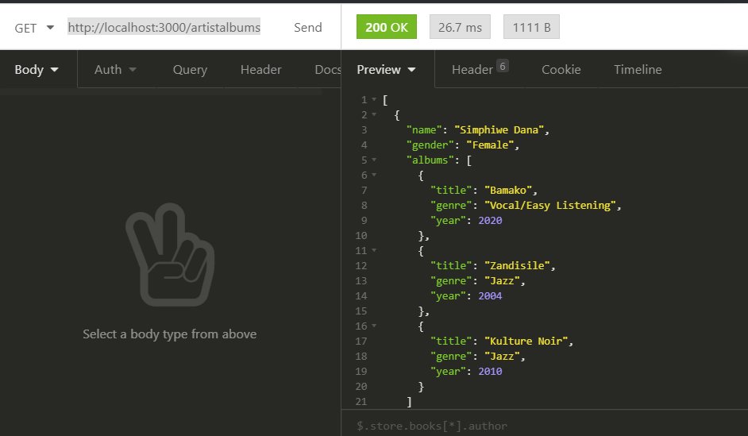

# Connecting to MSSQL Server from NodeJS

## Getting Microsoft SQL Server installed

Download the Microsoft SQL Server Docker image. Skip this if you have a locally installed version of SQL Server.

```bash
docker pull mcr.microsoft.com/mssql/server
```

This container runs a Linux version of SQL Server.

Run your docker container using this command

```bash
docker run -e 'ACCEPT_EULA=Y' -e 'SA_PASSWORD=yourStrong(!)Password' -e 'MSSQL_PID=Express' -p 1433:1433 -d --name=sql -v //c/dockermount/sqldata:/var/opt/mssql/data mcr.microsoft.com/mssql/server:2017-latest-ubuntu
```

> The line `-v //c/dockermount/sqldata:/var/opt/mssql/data` mounts a volume where SQL Server will save the databases locally in case you delete your contain. You can remove this part of the command if you don't care about persisting the data.

> The line `-e 'MSSQL_PID=Express'` runs the Express version of SQL which is enough for development and doesn't need any licencing.

## Clone the repo

```
git clone https://github.com/yeisane/nodemssql.git
```

## Restore node modules

```
cd nodemssql
npm install
```

## Environment file

Rename **.env.example** to **.env**. This file contains the database config settings.


## Run the project

```
npm start
```

## Test the API endpoints

For GET requests, you can use the browser to test your api. For other verbs (POST, PUT, PATCH) you can use either [POSTMAN](https://www.postman.com/downloads/), [INSOMNIA](https://insomnia.rest/download/) or any other tool of your choice.


> GET - <http://localhost:3000/artistalbums>

